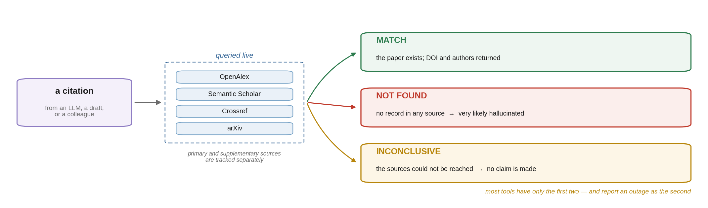

# scholarcheck

[](https://pypi.org/project/scholarcheck/) [](https://github.com/GuoCheng24/scholarcheck/actions/workflows/test.yml) [](https://www.python.org/) [](LICENSE)

**Stop hallucinated citations.** Verify any reference against real metadata — from the command line, with zero dependencies.

<p align="center">
  
</p>

<sub>The figure above is generated by <a href="docs/three-states_figure.py">docs/three-states_figure.py</a> — <code>pip install sciglyph</code> and run it to reproduce <code>docs/three-states.png</code> byte for byte.</sub>


Language models invent plausible-looking papers: right-sounding title, plausible authors, a DOI that resolves to nothing. `scholarcheck` answers one question honestly — **does this paper actually exist?** — by querying OpenAlex, Semantic Scholar, Crossref and arXiv directly.

```console
$ scholarcheck verify "Deep Residual Learning for Image Recognition"
MATCH (high confidence)   [query term coverage = 100%]
Deep Residual Learning for Image Recognition  (2016, conference-paper; cited=226875)  doi:10.1109/cvpr.2016.90
    Kaiming He, Xiangyu Zhang, Shaoqing Ren et al.

$ scholarcheck verify "Quantum Topological Radiomics for Zebra Diagnosis in Martian Cohorts"
NOT FOUND in any of the four sources -> this citation is very likely hallucinated
```

## Why not just ask an AI assistant?

Because an assistant answers from memory, and memory is exactly what fails here. Three design choices make this different:

**1. It says "I could not check" instead of "it is fake."**
A verifier that reports a network outage as *hallucinated* is worse than no verifier. `scholarcheck` tracks every failed request and distinguishes the two:

```console
$ scholarcheck verify "Attention Is All You Need"     # with the network down
INCONCLUSIVE - could not query the sources, so nothing can be said about: Attention Is All You Need
  Could not reach: api.openalex.org: curl: (7) Connection refused
  (no proxy set; if your network needs one, set SCHOLARCHECK_PROXY)
```

It also knows which sources matter: Semantic Scholar rate-limits aggressively without an API key, so its failure never turns a real answer into "inconclusive" — only the primary sources do.

**2. It refuses to guess.**
Ask for BibTeX from a slightly-wrong title and most tools hand back the nearest hit. Silently citing the *wrong* paper is worse than citing none, so a weak match returns the candidate and stops:

```console
$ scholarcheck bibtex "Deep Residual Learning for Image Recognition in Medicine"
No confident match (best term coverage only 62%). Refusing to emit a possibly wrong entry.
Closest candidate:
  Deep Residual Learning for Image Recognition  (2016, CVPR)  doi:10.1109/CVPR.2016.90
-> If that is the paper, re-run with its DOI: scholarcheck bibtex "<DOI>".
```

The same refusal applies when the sources themselves are unavailable, which is
when a wrong entry is most likely — the "best" match would then be whichever
paper happened to be reachable:

```console
$ scholarcheck bibtex "Deep Residual Learning for Image Recognition in Medicine"
INCONCLUSIVE - a primary source could not be reached, so no entry is emitted for: ...
  Could not reach: api.openalex.org: HTTP 429
  (the partial search's best candidate was 50% coverage - not enough to stand on
   while sources are down)
```

**3. An identifier is resolved, not searched.**
`verify "arXiv:1906.08253"` looks the identifier up directly. Feeding it to a
title matcher would return whatever paper happens to share those digits and
then score it as a mismatch — which reads as *"this citation is fake"* when the
truth is that the query was never looked up properly.

**4. Recency is a separate command, on purpose.**
Relevance ranking systematically favours highly-cited older work, which is exactly wrong when you are checking whether someone *just* published your idea. `latest` filters by recency as well as relevance.

## Install

```bash
pip install scholarcheck
```

**No dependencies.** Standard library plus `curl` — a fresh virtualenv gains
exactly one package and nothing else. Nothing to break, nothing to audit, and
no API key: every source it queries is open.

## Check a whole bibliography

The thing you actually want before submitting: does every reference in this
paper exist?

```console
$ scholarcheck audit refs.bib
  ok       wang2025kakeya  Volume estimates for unions of convex sets, and the Kakeya set conject
  ok       he2016resnet    registered at doi.org (metadata lookup unavailable)
  SUSPECT  fake2024zebra   not registered at doi.org: 10.9999/nonexistent.2024.00001

3 references: 2 verified, 1 suspect, 0 unchecked
Suspect entries did not resolve anywhere reachable. Check them by hand before submitting.
```

<sub>That is a real run, and the middle line shows why the DOI registry is queried
directly: OpenAlex was rate-limiting at the time, so the metadata lookup failed —
but doi.org still settled whether the DOI exists, which is the question being
asked. Without that path the same run reported two entries as unchecked and
exited 0, having found nothing.</sub>

Exit code is 1 when anything is suspect, so it drops into a pipeline as it is.
It reads a `.bib`, or a plain file with one DOI / arXiv id / title per line.

A DOI is checked against **doi.org itself**, not only the aggregators. The
registry is the authority on whether a DOI exists, and asking it directly means
the audit still works when OpenAlex is throttling — which on a shared CI runner
is the normal case, not the exotic one.

**A reference that could not be checked is reported as `unchecked`, not as
suspect, and does not fail the run.** A rate-limited database is not evidence
that your citation is invented, and failing someone's build on that basis would
be the same mistake this tool exists to prevent. `--strict` fails on those too,
if you would rather be stopped than proceed unsure.

### In CI

```yaml
- uses: GuoCheng24/scholarcheck/action@main
  with:
    path: refs.bib
    mailto: you@example.com     # OpenAlex polite pool - much higher limits on a shared runner
```

### As a pre-commit hook

```yaml
repos:
  - repo: https://github.com/GuoCheng24/scholarcheck
    rev: v0.1.2
    hooks:
      - id: scholarcheck
```

## Commands

| | |
|---|---|
| `audit <file.bib>` | Check every reference in a file; exit 1 if any is suspect |
| `verify "<title/DOI/arXiv id>"` | Is this citation real? An identifier resolves exactly; a title is matched by term coverage |
| `bibtex "<DOI/title>"` | A BibTeX entry — refuses to guess on a weak match |
| `search "<keywords>"` | Multi-source search, re-ranked by term overlap |
| `latest "<keywords>"` | Recent work only — relevance **and** recency |
| `priorart "<claim>"` | Nearest N real papers for a claim, plus a checklist for judging whether it is already taken |
| `citedby "<DOI/title>"` | What cited this paper — has someone already extended it? |
| `journal "<name>"` | Live journal metrics, instead of quoting an impact factor from memory |
| `injournal "<name>"` | Recent papers from one journal, to study its actual conventions |
| `fetch "<DOI/arXiv id>"` | Download the open-access PDF so a claim can be checked in full text |

Add `--json` to any command for structured output, `-n` for the number of results, `--since YYYY` to bound the year.

## Use as a library

```python
from scholarcheck import verify_citation, get_bibtex, NET_ERRORS

paper, confidence = verify_citation("Attention Is All You Need")
if paper is None and NET_ERRORS:
    ...          # could not check — not evidence of anything
elif confidence >= 0.75:
    print(get_bibtex(paper["doi"]))
```

## Configuration

All optional:

| variable | effect |
|---|---|
| `SCHOLARCHECK_MAILTO` | your email — joins OpenAlex's polite pool, giving better rate limits |
| `SCHOLARCHECK_S2KEY` | Semantic Scholar API key (free) — avoids the frequent 429s |
| `SCHOLARCHECK_PROXY` | e.g. `socks5h://127.0.0.1:1080`; default is a direct connection |

Proxy behaviour is decided **solely** by `SCHOLARCHECK_PROXY`. Inherited `http_proxy` / `all_proxy` variables are stripped before each request, so the tool behaves the same on every machine.

## What it can and cannot tell you

**A match confirms the paper exists — not that the metadata you have is right.**
Bibliographic databases often hold several records for one work: a preprint, a
conference version, a publisher deposit. `verify` returns whichever record
matched best, so the year and venue you see may belong to a different record
than the one you meant to cite. Check them; the DOI is the reliable part.

**"NOT FOUND" is strong evidence, not proof.** Very new work, non-English
venues and some book chapters are indexed poorly. When it matters, run
`search` with looser keywords before concluding a reference is invented.

## Notes from real use

- **Feed focused keywords, not whole sentences.** A long claim drags in off-topic papers; two or three precise terms work far better.
- **`search` favours highly-cited older work.** That is what relevance ranking does. Use `latest` when the question is "has this been done recently?"
- **A title-only judgement is not a prior-art check.** For the closest candidates, `fetch` the PDF and read it.

## Who maintains this

Guo Cheng, University of Chinese Academy of Sciences — medical imaging and machine
learning methods. This tool came out of checking my own citations before submitting, after watching a language model hand me three papers that did not exist.

Corrections, bug reports and feature requests all go to
[Issues](https://github.com/GuoCheng24/scholarcheck/issues). Please open one rather than
emailing: a public answer helps whoever hits the same thing next, and it is
searchable.

## Other things from the same desk

Written while trying to get papers out, so they tend to be useful at the same points in that process:

- [docxaudit](https://github.com/GuoCheng24/docxaudit) — find what your converter silently dropped from a .docx
- [sciglyph](https://github.com/GuoCheng24/sciglyph) — draw publication figures as code, in pure matplotlib
- [world-model-map](https://github.com/GuoCheng24/world-model-map) — a map of open-source world models and where their authors say they break
- [kakeya-conjecture-lab](https://github.com/GuoCheng24/kakeya-conjecture-lab) — an interactive lab for the Kakeya conjecture, with a box-counting meter

## License

MIT © Guo Cheng

## 关于那行 star 提示

跑命令时，`scholarcheck` 会在**第 5 次和第 25 次**往 stderr 写一行，提一句这个仓库在哪。**一辈子只有这两次**，此外再不出声。

它不会出现在：管道或重定向里（stderr 不是终端就直接返回，连计数文件都不建）、CI 环境里（`CI` / `GITHUB_ACTIONS`）。它写的是 stderr 而非 stdout，所以不会污染你的数据输出；它包在 `try/finally` 里且吞掉自身所有异常，**不会改变退出码，也不会影响结果**。

永久关掉：

```bash
export SCHOLARCHECK_NO_NUDGE=1
```

计数存在 `$XDG_STATE_HOME/scholarcheck/usage.json`（默认 `~/.local/state/scholarcheck/usage.json`），删掉即重置。
